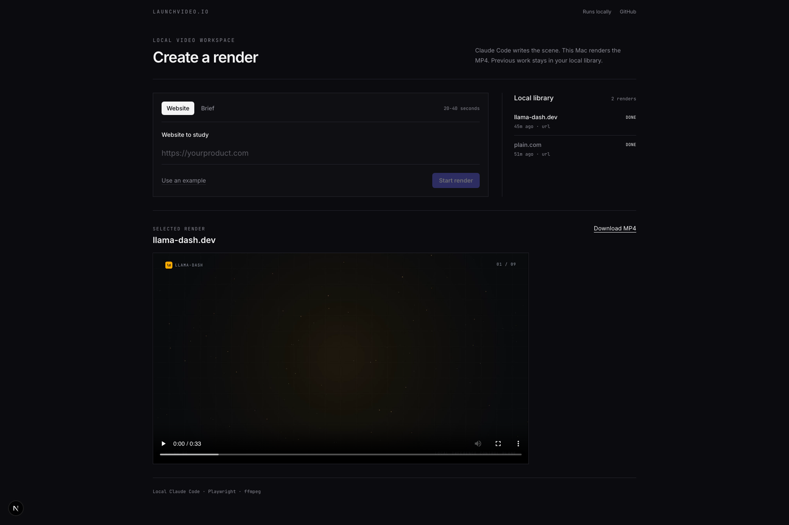

# LaunchVideo, local Claude Code edition

Paste a URL or a prompt, get a 20 to 40 second launch video. No video model:
Claude Code writes a single HTML film, then this Mac renders it frame by frame
in headless Chromium and encodes it with ffmpeg. It uses the existing Claude
Code login, so it does not require `ANTHROPIC_API_KEY`, Vercel, or a Blob
store.

This fork is intended for local use. It launches Claude Code and renders video
on the same machine running the Next.js app.



```
local/          local Claude Code worker and Playwright + ffmpeg renderer
web/            Next.js app, local job API, and local MP4 streaming route
```

## Quick Start

Requirements:

- macOS on Apple Silicon. The renderer has been verified on a MacBook Pro.
- Node.js 22 or newer.
- Claude Code installed and logged into a Claude subscription. An API key is
  not used.

```bash
# Clone your fork and use the local-first branch.
git clone git@github.com:ndom91/shipvideo-local.git
cd shipvideo-local
git switch local-claude-run

# Install workspace dependencies, Playwright, and its copy of headless Chromium
pnpm setup-local

# Start the web app where you can enter any prompt / URL input to generate a video
pnpm dev
```

Open http://localhost:3000 and submit either a URL or a brief.

## Configuration

The defaults require no environment file. Optional environment variables:

| Variable | Default | Purpose |
| --- | --- | --- |
| `CLAUDE_MODEL` | `opus` | A Claude Code model alias, such as `sonnet` or `opus`. |
| `CLAUDE_COMMAND` | `claude` | Path to the Claude Code executable if it is not on `PATH`. |

For example:

```bash
CLAUDE_MODEL=sonnet pnpm dev
```

Run that command from the repository root after installing dependencies.

## Local Files

Each request gets an isolated directory at `web/.local-jobs/<job-id>/`:

- `job.json`: validated form input.
- `scene.html` and `scene.json`: Claude's generated film and duration.
- `claude.log`: Claude Code and renderer output for debugging.
- `video.mp4`: completed output.
- `state.json`: job status consumed by the UI.

These directories are ignored by Git. The completed MP4 is streamed locally at
`/api/videos/<job-id>`; it is not uploaded anywhere.

## How a job flows

1. `POST /api/jobs` validates the input, creates an isolated job folder, and
   launches a detached local worker.
2. The worker calls `claude -p` in that folder. Claude uses its existing
   subscription login to research the source and write `scene.html`.
3. Claude checks the scene with `local/render.mjs --check` and the worker then
   renders it with Playwright's Chromium headless shell and `ffmpeg-static`.
4. `GET /api/jobs/<id>` reads the local state file for progress, and
   `GET /api/videos/<id>` streams the finished MP4 with range support.

Rendering runs at roughly real time: a 30 s film takes 30-40 s on a MacBook Pro.

## Gotchas

- No `<video>`, `<audio>`, `<iframe>`, CSS transitions, `Math.random`, or
  external images in a scene; the worker prompt and renderer enforce this so
  renders stay deterministic.
- The job worker only permits Claude Code's file tools, WebFetch, and the
  `node` scene-check command. It does not grant arbitrary shell access.
- URL mode asks Claude to read a public site. Treat submitted URLs as untrusted
  content and keep this app bound to localhost unless you add authentication
  and network restrictions.

## Troubleshooting

| Problem | Check |
| --- | --- |
| Job fails immediately | Run `claude auth status`; it must report `loggedIn: true`. |
| Renderer cannot launch Chromium | Re-run `pnpm setup-local` from the repository root. |
| Job says scene validation failed | Read `web/.local-jobs/<job-id>/claude.log`; Claude's generated `scene.html` is alongside it. |
| `claude` is not found | Set `CLAUDE_COMMAND` to its full path before starting `pnpm dev`. |
